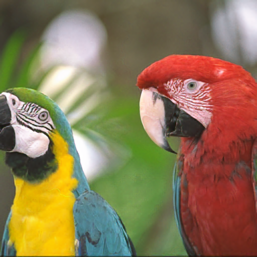
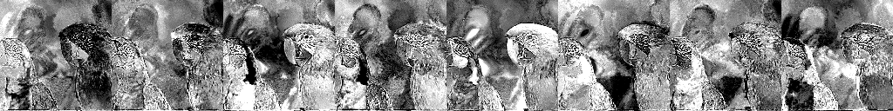
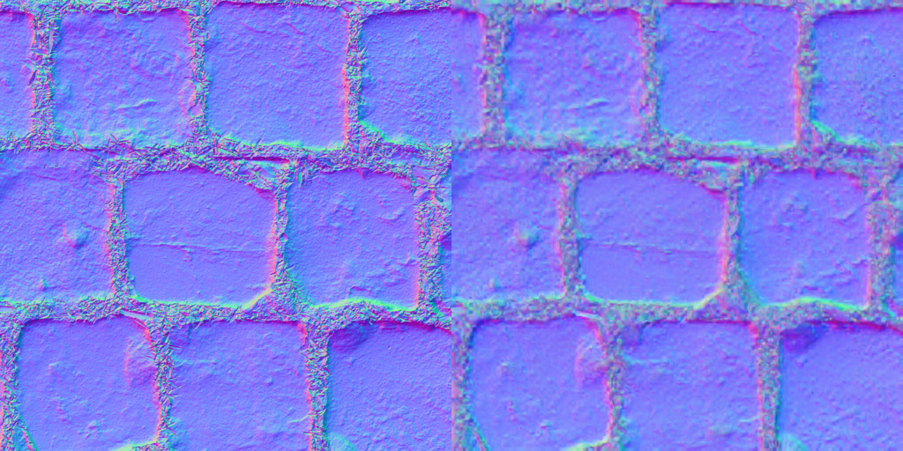
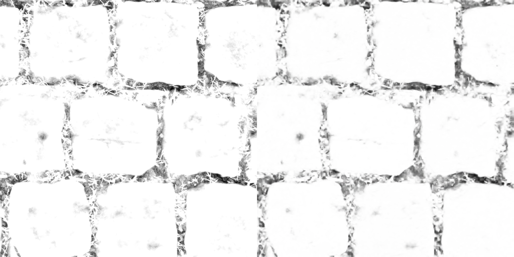

# toy neural texture compression trained with Evolution Strategies

A small, self-contained C++ experiment: an RGB image (or up to four same-size
RGB textures of one material) is encoded as a shared low-resolution latent
texture plus a tiny MLP decoder, and both are trained
**entirely with Evolution Strategies** — no backprop, no autodiff, no
training framework. (An optional late-training polish, `--mlp-fd`, switches
the decoder to numerical finite differences; still no backprop.) Dependencies are `stb_image`, `stb_image_write`, and OpenMP.

Write-up: [Fitting a neural texture decoder with ES](https://richg42.blogspot.com/2026/09/fitting-neural-texture-decoder-with-es.html)

```
I(u,v) ≈ MLP( bilinear(Z, u, v), phi(u,v) )
```

`Z` is the latent texture, `phi` a small positional encoding. At decode time
each pixel bilinearly samples `Z` at its UV, appends `phi`, and runs the MLP.
An optional second, coarser latent level (`--latent2`) is sampled at the same
UV and its channels are concatenated onto the first level's.

## Results

512×512 crop of kodim23, 3000 iterations, latent quantized to 8 bits after
training, MLP weights counted as fp16:

| Latent      | PSNR    | bpp (raw) | bpp (entropy coded) |
|-------------|---------|-----------|---------------------|
| 64×64×4     | 26.9 dB | 0.56      | 0.47                |
| 64×64×8     | 28.2 dB | 1.07      | 0.87                |
| 128×128×4   | 30.3 dB | 2.06      | 1.65                |
| 128×128×8   | 32.2 dB | 4.07      | 3.27                |

These runs used the original positional encoding `uv,fourier:1` (`--nfreq 1`),
which is why the evaluation command below passes it. The current default is
`uv` only, which scored 0.26–0.32 dB higher where both were run (see
METHOD.md); the results quoted later in this file use that default unless
stated otherwise.

The 128×128×8 run uses a 14 → 24 → 24 → 3 MLP (1035 weights, leaky ReLU,
sigmoid output) and trains in about 150 s on a 32-thread CPU. Quantizing the
latent to 8 bits costs 0.04 dB.

Output of that run (`out_128c8/`): target crop, reconstruction after 3000
iterations, and the eight latent channels side by side.

| Target | Reconstruction (32.2 dB) |
|--------|--------------------------|
|  |  |



`out_128c8/model.bin` is the trained model; evaluate it with
`ntc kodim23.png --load out_128c8/model.bin --latent 128 128 8 --nfreq 1 --iters 0`.

### A 4-layer material

The PavingStones070 material (normal, roughness, albedo, AO; see
[Test images](#test-images)) trained jointly from one shared 128×128×4 +
64×64×4 latent and one 10 → 36 → 36 → 12 MLP (2172 weights), 3000
iterations, learning rate annealed over the second half, per-weight finite
differences for the decoder over the last quarter. 8-bit latent: 2.64 bpp
total, 0.66 bpp per texture. Left is the target, right the reconstruction
from the quantized latent (`out_m1234/`). The training command was

```
ntc m1.png m2.png m3.png m4.png --latent 128 128 4 --latent2 64 64 4 --mlp 36,36 --mlp-pairs 64 --iters 3000 --lr-anneal 0.5 0.05 --mlp-fd 0.75 --out out_m1234
```

| Normal map, 23.2 dB |
|---|
|  |

| Roughness, 31.5 dB |
|---|
|  |

| Albedo, 23.2 dB |
|---|
|  |

| Ambient occlusion, 29.6 dB |
|---|
|  |

`out_m1234/model.bin` is the trained material; evaluate it with
`ntc m1.png m2.png m3.png m4.png --load out_m1234/model.bin --latent 128 128 4 --latent2 64 64 4 --mlp 36,36 --iters 0`.

## How the ES training works

* **MLP:** antithetic ES, 32 perturbation pairs per step, each pair evaluated
  on the same random 4096-pixel minibatch. The estimated gradient is fed to Adam.
  Optional late phases: full-image minibatch (`--mlp-full`), per-weight
  finite differences (`--mlp-fd`), or frozen decoder (`--mlp-freeze`).
* **Latent:** all latent values are perturbed at once and the full image is
  decoded twice per pair, 4 pairs per step. Each pixel's loss change is credited
  only to the (up to) 4 texels its bilinear tap reads, on each latent level.

  Ordinary ES already updates every parameter from one antithetic pair, but its
  variance grows with parameter count: the single scalar loss difference is the
  sum of thousands of separate local effects, and each texel's share is
  buried under everyone else's. Here each texel's loss difference is measured
  only over the pixels in its own bilinear footprint, so noise from the other
  ~16k texels is discarded instead of averaged. That credit assignment, not the
  per-evaluation cost, is what makes ES practical on a latent with 131k values
  using only 4 pairs per step.
* The latent stays fp32 during training; quantization is applied afterwards
  and reported at a configurable bit depth.

## Building

CMake generating a Visual Studio solution (MSVC), or any C++17 compiler with
OpenMP on Linux/WSL. Tested with MSVC 2022 and MSVC 2026 on Windows, and
gcc 13 under WSL2. Note that `std::normal_distribution` differs between
standard libraries, so the same seed gives slightly different results on
each platform.

```
cmake -S . -B build -G "Visual Studio 17 2022" -A x64
cmake --build build --config Release
```

For Visual Studio 2026 use `-G "Visual Studio 18 2026"`, which needs
CMake 4.2 or newer (the CMake bundled with VS 2026 works).

## Running

```
ntc image.png --out out --latent 128 128 8 --iters 3000
ntc albedo.png normal.png rough.png --weights 1,1,0.5 --out out_mat --latent 128 128 8 --latent2 64 64 4
```

Several positional images form a material: they must have the same size after
cropping, share the latent and the MLP (3 outputs per texture), and can be
weighted in the loss with `--weights` (relative; a weight of 0 drops that
texture from training). Per-texture PSNRs are printed alongside the overall
one, output files gain a `_tK` suffix, and the bitrate is reported both per
material pixel and per texture.

Run with no arguments, `ntc` trains on the checked-in `kodim23.png` using the
default 64×64×4 latent. Images are located relative to the executable, so
this works from the build directory as well as the repo root. A named image
that cannot be found is an error; the synthetic fallback only applies when no
image is named.

Progress is printed to stdout (MSE, PSNR, quantized PSNR and bitrate, latent
stats, throughput). Reconstructions, a latent visualization per level, and
`model.bin` are written to the output directory periodically; `side_by_side.png`
(target | 8-bit-latent decode) is written at the end.

Useful options (`ntc --help` lists them all):

| Flag | Meaning |
|------|---------|
| `--latent W H C` | latent texture size (default 64 64 4) |
| `--latent2 W H C` | optional second (typically coarser) latent level, e.g. 32 32 4 (off) |
| `--weights w0,w1,...` | per-texture loss weights for a material, one per positional image (relative; 0 drops a texture) |
| `--lat2-sigma F` | ES sigma for the second level (default: same as `--lat-sigma`) |
| `--lr-anneal START FINAL` | decay both learning rates linearly from 1× at START·iters to FINAL× at the end |
| `--mlp W1,W2,...` | hidden layer widths (default 24,24) |
| `--act leaky\|relu\|tanh\|sine` | hidden activation |
| `--pos SPEC` | positional features: `uv`, `fourier:N`, `dct:N`, `local`, `lfourier:N`, `lquad`, `ldct:N`, `ldct2:N`, `ldct4:N`, `none` |
| `--nfreq N` | shorthand for `--pos uv,fourier:N` (the encoding the headline table used) |
| `--qbits N` | latent bit depth for the reported quantized PSNR / bitrate |
| `--load model.bin --iters 0` | evaluate a saved model |
| `--mlp-pairs`, `--mlp-batch`, `--mlp-sigma`, `--mlp-lr`, `--mlp-every`, `--lat-pairs`, `--lat-sigma`, `--lat-lr` | ES hyperparameters |
| `--mlp-fd START`, `--mlp-fd-h H` | from START·iters, train the MLP by central finite differences per weight |
| `--mlp-full START`, `--mlp-full-pairs N` | from START·iters, evaluate the MLP ES step on the full image |
| `--mlp-freeze START` | from START·iters, stop updating the MLP (latent-only phase) |
| `--lat-alt` | two latent levels: perturb one level per pair, rotating, to remove cross-level crosstalk |

Images larger than 512×512 are center-cropped by default (`--crop`); all
textures of a material are cropped identically and must match afterwards.

## Test images

* `kodim23.png`, `kodim01.png`, `kodim02.png`: the Kodak test set (768×512,
  center-cropped to 512×512 by default). kodim23 is the parrots.
* `m1.png` … `m4.png`: a 4-layer cobblestone material at 512×512, in order
  normal map, roughness, albedo, ambient occlusion. Derived from
  [PavingStones070 on ambientCG](https://ambientcg.com/view?id=PavingStones070),
  released under Creative Commons CC0 1.0. Train it as a material with
  `ntc m1.png m2.png m3.png m4.png ...`.

## Prior art disclosure

Published September 3, 2026 (blog post above and this repository); updated
September 4, 2026 with the two-level latent, materials, and the items marked
as such. The following are disclosed
here as public prior art.

Neural texture representations using learned latent grids with small neural
decoders, and Evolution Strategies / simultaneous-perturbation methods for
derivative-free optimization, are established ideas. The technically
distinctive part explored here is their combination with the decoder's known
spatial dependency structure: all latent values are perturbed simultaneously,
antithetic full-image evaluations produce per-pixel loss differences, and each
pixel's loss difference is attributed only to the latent texels actually read
by that pixel's filtering footprint. This yields simultaneous,
support-restricted ES estimates for every latent texel while discarding loss
variation from pixels a given texel cannot affect. Estimates for neighboring
texels still share pixels and the same perturbation draw, so they are
correlated rather than independent.

For a given latent value, the omitted per-pixel loss terms do not depend on
that value's perturbation, so their products with it have zero expectation in
the ordinary Gaussian ES estimator. Footprint attribution therefore removes
them without bias, as a variance-reduction mechanism that follows directly
from the decoder's dependency graph.

Implemented in this repository:

* A low-resolution latent texture plus a small MLP decoder, with **both the
  latent and the decoder optimized entirely by antithetic Evolution
  Strategies**, without backpropagation or analytic derivatives (an optional
  finite-difference polish for the decoder is numerical, not autodiff).
* **Support-restricted footprint attribution for latent ES:** all latent values
  are perturbed simultaneously and the full image is decoded for +ε and −ε.
  Each pixel's loss difference is attributed only to the latent texels in that
  pixel's bilinear sampling footprint, so one antithetic decode pair produces
  simultaneous local ES estimates across the entire latent while excluding loss
  terms that cannot depend on each texel.
* Separate ES schedules matched to parameter support: minibatched, many-pair ES
  for the globally acting decoder weights, and full-image, few-pair
  footprint-attributed ES for the spatially local latent, interleaved every
  iteration, with the estimates fed through Adam.
* **Late-training decoder phases** (added September 4): from a chosen fraction
  of the run, the decoder step can switch to (a) antithetic ES evaluated on
  the full image, (b) per-weight central finite differences on a shared
  minibatch, a numerical gradient with no autodiff, with the decoder's Adam
  state reset at the switch because the ES phase's second-moment estimate
  otherwise throttles it, or (c) no decoder updates at all (latent-only
  phase). Measured on mario with the 128×128×4 + 64×64×4 configuration, a
  36,36 decoder, 64 ES pairs, and the learning rate annealed over the second
  half: finite differences over the last quarter gained 0.27 dB at 3000
  iterations and 0.42 dB at 6000 (31.38 → 31.80 dB), matching a 12000
  iteration run in half the iterations; the Adam reset more than doubled the
  effect; the full-image and frozen phases changed nothing measurable.
* **Learning-rate annealing under ES** (added September 4): decaying both
  learning rates linearly over the second half of a run. Because ES gradient
  noise is re-injected every step, a fixed-rate Adam run settles at a jitter
  floor; annealing removed most of a visible texel-aligned artifact and gained
  0.85 dB at 6000 iterations on mario with a single 128×128×8 latent and the
  `ldct:2` positional input (31.36 → 32.21 dB) and 0.56 dB on the two-level configuration above
  (30.82 → 31.38 dB).
* **Alternating-level perturbation** (added September 4, `--lat-alt`): with
  two latent levels, each antithetic pair perturbs only one level, rotating
  across steps, with each level's gradient scaled by its own pair count. This
  removes cross-level crosstalk in the footprint attribution exactly; measured
  with a 64×64 second level it lost 0.17 dB, because halving each level's
  pair count cost more than the small crosstalk it removed.
* Post-training scalar quantization of the latent with per-channel scale, and
  reported bitrate at arbitrary latent bit depth.
* Pluggable positional encodings for the decoder, including cell-periodic
  cosine features of the bilinear cell offset (`ldct:N`), found to improve
  quality at fine latent resolution.
* Configurable decoder depth, width, and activation; saved models record the
  size of every latent level, MLP layout, activation, positional spec, and
  texture count (not the output mapping or the loss weights; see METHOD.md §7).
* **Two-level latent pyramid** (added September 4, `--latent2`): a second latent texture sampled
  at the same UV and concatenated onto the first, trained with the same
  footprint attribution applied once per level. Measured at 3000 iterations,
  8-bit latent: kodim23 64×64×4 + 16×16×4 gives 27.47 dB at 0.59 bpp versus
  27.16 dB at 0.55 bpp for 64×64×4 alone; mario 128×128×4 + 32×32×4 gives
  29.08 dB at 2.18 bpp versus 28.82 dB at 2.05 bpp.
* **Materials trained by ES** (added September 4): up to four same-size RGB
  textures trained jointly from one shared latent and one MLP with three
  outputs per texture, with per-texture loss weights and per-texture
  reporting. Compressing a material's textures jointly from a shared latent is
  established practice in neural texture compression; what is disclosed here
  is doing it entirely derivative-free: the per-pixel loss sums over every
  texture's channels before footprint attribution, so one antithetic decode
  pair of the whole material yields the support-restricted ES estimate for
  every latent texel with respect to all textures at once, and the decoder is
  trained by ES or per-weight finite differences, with no backpropagation
  through any texture. The weights enter the per-pixel loss before
  attribution, so a zero weight removes that texture's influence on the latent
  gradient exactly. Results at 3000 annealed iterations
  with per-weight finite differences over the last quarter, 8-bit latent:
  the 4-layer PavingStones070 material (normal, roughness, albedo, AO)
  sharing 128×128×4 + 64×64×4 and a 36,36 decoder reaches 23.2 / 31.5 /
  23.2 / 29.6 dB at 0.66 bpp per texture (2.64 bpp total); the first two
  layers alone reach 25.0 / 32.5 dB at 1.31 bpp per texture. Two unrelated
  photographs (kodim23 + mario) sharing 128×128×8 + 64×64×4 (annealed, no
  finite-difference phase) land at 30.4 and 29.6 dB at 2.3 bpp per texture,
  about what each gets alone at a similar per-texture bitrate, as expected
  when there is nothing to share.

Described, not yet implemented:

* **Quantization-aware training under ES:** quantize (or block-compress) the
  latent inside the decode used for every ES evaluation. Because ES only
  observes loss values, any non-differentiable quantizer or codec can sit in
  the loop with no straight-through estimator or differentiable surrogate.
* **Block-compressed latents (BC1/BC4/BC7/ASTC) in the training loop**, with
  loss attribution per compressed block rather than per texel.
* **Search directly in the encoded domain:** drop the float latent and run ES
  (or stochastic coordinate descent) over block endpoints and indices
  themselves, so the trainer and the texture compressor are the same program.
* **Non-overlapping perturbation phases:** perturb only texels or blocks on
  one phase of a 2×2 grid per evaluation so that, under bilinear sampling,
  no two perturbed footprints overlap and neighbor crosstalk vanishes; cycle
  the phase to cover all parameters. (Level alternation above is the
  cross-level analogue and is implemented; the within-level version is not.)
* **Latent initialization from the image itself** (a downsampled, projected
  copy of the target) and decoder initialization from a previously trained
  model, as warm starts for ES training.
* **Materials with non-RGB channel counts** (single-channel roughness or AO,
  two-channel normals) and normal-map-aware losses.
* Learned interpolation kernels expressed as a few global parameters rather
  than as decoder inputs.

## Status

This is a deliberately simple research toy for learning and experimentation,
not a codec. Nothing is tuned. Obvious next steps: quantization-aware
training, block-compressed (BC/ASTC) latents inside the training loop,
non-RGB channel counts for materials (single-channel roughness/AO,
two-channel normals) with normal-map-aware losses, and alternative losses.
